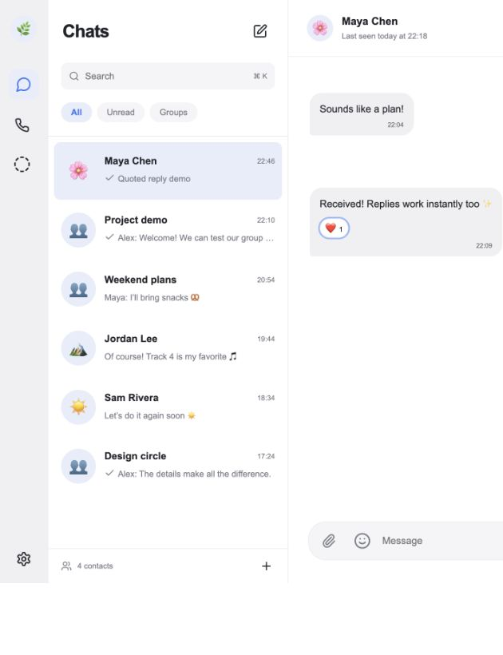

# Signal Clone

A Signal-inspired messaging application for the fullstack recruitment assignment. Built from scratch with **Next.js + TypeScript**, **FastAPI**, **SQLite**, and **WebSockets**.

**Live demo:** [tanishq-signal-clone.vercel.app](https://tanishq-signal-clone.vercel.app) · [API health](https://signal-clone-api-u17l.onrender.com/health). The backend runs on Render's free tier: it can take around a minute to wake after inactivity, and its SQLite data can be erased when the service restarts or redeploys. Use only the seeded demo accounts and test data.

> Educational demo, not an official Signal client. Sign-in and registration both use the fixed mock OTP `123456`; the sample-account shortcuts only fill a username. Messages are stored as plaintext; real end-to-end encryption is not implemented. Do not use it for private communication.



## Run locally

Requirements: Node.js 22+, Python 3.11+, npm. Use two terminals.

**Terminal 1 — backend**

```bash
cd backend
python3 -m venv .venv
source .venv/bin/activate
# Windows PowerShell: .venv\Scripts\Activate.ps1
pip install -r requirements.txt
cp .env.example .env
uvicorn app.main:app --reload --env-file .env --host 127.0.0.1 --port 8000
```

**Terminal 2 — frontend**

```bash
cd frontend
npm ci
cp .env.example .env.local
npm run dev
```

Open **http://localhost:3000** when running both servers on your own computer. API documentation is at **http://localhost:8000/docs**. The database and demo data are created automatically on the backend's first start. To use the already-hosted app, open the [live Vercel demo](https://tanishq-signal-clone.vercel.app/) instead.

If your Python installation lacks wheels for an optional `uvicorn[standard]` dependency, use Python 3.13 (the version used for validation).

### Demo accounts

| Username | Display name |
| --- | --- |
| alex | Alex Morgan |
| maya | Maya Chen |
| jordan | Jordan Lee |
| sam | Sam Rivera |
| riley | Riley Park |
| priya | Priya Shah |
| noah | Noah Brooks |
| ella | Ella Kim |

Sign-in and registration both use the fixed mock OTP **123456**. Enter a username or phone-number identifier, then the code. Registration also collects a display name and avatar. The sample-account shortcuts fill Alex, Maya, or Jordan's username and still require the code. No SMS is sent; this does not prove ownership of an identifier. New accounts start with three demo contacts and Note to Self. Existing accounts retain their stored profile; edit it in Settings.

For a two-user demonstration, use a normal window for Alex and an incognito/private window for Maya. On your development machine you can also use `localhost:3000` and `127.0.0.1:3000` as separate storage origins. Two tabs on the same origin share local storage, so separate profiles/private windows are preferred.

### Docker alternative

```bash
docker compose up --build
```

The named `signal-data` volume persists SQLite across container restarts. These container files are provided for convenience; native execution was tested, Docker execution was not tested in the development environment.

## Features

- Two-step mock OTP sign-in and registration, seven-day sessions, logout, name and emoji avatar editing.
- Contacts, search by name/username, conversation previews, unread counts, and per-user pin, mute, archive, and mark-as-read controls.
- Private Note to Self for every account, including newly registered users.
- Persistent direct messages with optimistic sending, retry on failure, and deduplication.
- Live delivery/read receipts, typing indicators, online/last-seen presence.
- Groups with persistent membership, admin-only add/remove controls, server-side authorization.
- Signal-inspired conversation sidebar, bubbles, modals, search/filter controls and in-app toasts.
- Attachments up to 10 MB, with in-chat previews for PNG/JPEG/GIF/WebP and authenticated downloads for all files.
- Live emoji reactions (one reaction per person per message, click again to remove), quoted replies with jump-to-original.
- Message actions: copy text, edit your own text, delete for yourself, or delete your own message for everyone. A shared deletion leaves a visible tombstone and removes attached file bytes and reactions.
- Functional disappearing-message timers: off, 10 seconds, 1 minute, 1 hour, 1 day, 1 week. The timer applies only to newly sent messages; groups require admin control.
- Dark mode, responsive desktop/tablet/mobile layouts, emoji insertion and quoted replies.
- Cursor-based message pagination; search within loaded messages.
- Keyboard shortcuts: Cmd/Ctrl+K to search, Cmd/Ctrl+N for a conversation, Cmd/Ctrl+Shift+F to search messages, Escape to close, Enter to send, Shift+Enter for a new line.
- Placeholder calls, stories, linked devices, privacy and system notification settings.

Real encryption is not implemented, as the assignment permits. Browser file previews and persisted attachments are meant for the small demo, not private communication.

## Architecture

```text
Next.js client
  ├── REST /auth, /contacts, /conversations/... → FastAPI → SQLite
  └── WebSocket /ws ← authenticated per-user event fan-out
```

REST performs durable operations. WebSockets carry small invalidation (`sync`) and transient typing events. On a sync event the client fetches authorized state from REST. On reconnect it fetches fresh state, so missed socket events do not lose messages. A 15-second periodic refresh also recovers state when the socket is unavailable. The database is the source of truth.

Sending creates one message and a receipt row for every other member in one transaction. Connected recipients get a delivery timestamp immediately. Offline recipients get it when they connect. A visible, focused active conversation marks its pending receipts as read. Group status becomes delivered/read only when **all original recipients** meet that status. No-recipient status stays sent.

The WebSocket hub is in memory: run **one Uvicorn worker and one backend instance**. Multiple instances would require shared pub/sub (for example Redis) and a database designed for distributed deployment.

### Project structure

```text
frontend/src/
  app/              Next.js layout, entry page and styles
  components/       Auth, Sidebar, Chat, Attachment, Dialogs, Messenger, shared UI
  lib/api.ts        API client and shared TypeScript models
  lib/useMessenger.ts  Fetching, WebSocket lifecycle, optimistic sends
backend/
  app/main.py       HTTP/WebSocket routes, validation and authorization
  app/db.py         Schema, additive migrations, transactions and WAL initialization
  app/features.py   Attachment validation and timed-message cleanup
  app/realtime.py   Per-user socket connections and event fan-out
  app/seed.py       Idempotent sample users/conversations/messages
  tests/           API, WebSocket and feature integration tests
```

## Database schema

| Table | Important fields | Purpose |
| --- | --- | --- |
| users | id, username UNIQUE, display_name, avatar, last_seen | Registered identities |
| sessions | token_hash PK, user_id FK, expires_at | Revocable, expiring bearer sessions |
| contacts | owner_id FK, contact_id FK, composite PK | Per-user address book |
| conversations | id, kind, name, direct_key UNIQUE, created_at, disappear_seconds | Direct and group chats with a timer |
| members | conversation_id FK, user_id FK, role, pinned, muted, archived, composite PK | Membership, group administration and personal chat preferences |
| messages | id, conversation_id FK, sender_id FK, body, created_at, client_id, reply_to FK, expires_at, edited_at, deleted_at | Message history; timed rows are purged |
| hidden_messages | message_id FK, user_id FK, composite PK | Per-user “delete for me” visibility |
| attachments | message_id PK/FK, name, media_type, size, content BLOB | One file per message, removed with the message |
| reactions | message_id FK, user_id FK, emoji, composite PK | One emoji per person per message |
| message_keys | sender_id, client_id, message_id, composite PK | Keeps retry IDs reserved after expiry |
| receipts | message_id FK, user_id FK, delivered_at, read_at, composite PK | Individual recipient delivery/read state |

Foreign keys are enabled on **every** connection. Composite keys stop duplicate contacts, members and receipts. `direct_key` is the sorted pair of user IDs (e.g. `1:2`), making direct-chat creation idempotent. `UNIQUE(sender_id, client_id)` makes message retries safe. Replies must reference the same conversation. Indexes support recent-message pagination, membership lookup and unread counting. All stored timestamps use UTC; the browser formats them locally.

## API overview

All routes except `/auth/login`, `/auth/register`, and `/health` require `Authorization: Bearer <token>`.

| Method | Endpoint | Purpose |
| --- | --- | --- |
| POST | /auth/login | Sign in to an existing account with the fixed mock OTP (`123456`) |
| POST | /auth/register | Create an account with the fixed mock OTP (`123456`) |
| POST | /auth/logout | Revoke current session and close its sockets |
| GET / PATCH | /me | Read/update profile |
| GET / POST | /contacts | List/add a registered contact |
| GET | /conversations | Member-only chat summaries |
| PATCH | /conversations/{id}/preferences | Change current member's pin, mute or archive flags |
| POST | /conversations/direct | Create or return a direct conversation |
| POST | /conversations/group | Create a group and its memberships |
| POST | /conversations/{id}/members | Admin adds a member |
| DELETE | /conversations/{id}/members/{user_id} | Admin removes a member |
| PATCH | /conversations/{id}/name | Admin renames a group |
| PATCH | /conversations/{id}/members/{user_id}/role | Admin promotes or demotes a member |
| DELETE | /conversations/{id}/leave | Leave a group if another admin remains |
| GET | /conversations/{id}/audit | Member-only recent group activity |
| GET | /conversations/{id}/messages?before=42&limit=50 | Paginated history |
| POST | /conversations/{id}/messages | Send `{body, client_id, reply_to?, attachment?}` |
| PATCH | /conversations/{id}/messages/{message_id} | Edit your own text message |
| DELETE | /conversations/{id}/messages/{message_id}?scope=me\|everyone | Hide for yourself or delete your own message for everyone |
| POST | /conversations/{id}/read | Mark current user's conversation receipts read |
| PATCH | /conversations/{id}/timer | Set disappearing-message duration |
| POST | /conversations/{id}/messages/{message_id}/reactions | Toggle or replace a reaction |
| GET | /conversations/{id}/messages/{message_id}/attachment | Authorized file download |
| WS | /ws | Authenticate first frame `{token}`, then typing/ping events |

FastAPI generates complete request/response documentation at `/docs`. Membership is rechecked for every history, send, read and typing operation; hiding a UI control is never the security boundary.

## Configuration

Backend variables are loaded from `.env` when started with `--env-file .env`; production providers inject them directly.

| Variable | Default | Notes |
| --- | --- | --- |
| FRONTEND_ORIGINS | http://localhost:3000,http://127.0.0.1:3000 | Exact comma-separated allowed origins, no trailing slash |
| DATABASE_PATH | backend/data/signal.db | Use a persistent disk path when hosted |
| SEED_DEMO | true | Seeds only an empty users table |
| NEXT_PUBLIC_API_URL | http://localhost:8000 | Frontend **build-time** variable; redeploy after changing |

## Validation

```bash
cd backend
source .venv/bin/activate
python -m pytest -q

cd ../frontend
npm run typecheck
npm run build
```

The integration suite covers mock OTP registration and sign-in, session persistence/logout, contacts, direct-chat uniqueness, authorization, validation, receipt transitions, duplicate sends, cross-chat reply rejection, pagination, group admin controls, WebSocket delivery/typing, repeatable seeding, attachment access/validation, reaction changes, timer permissions, expiry cleanup, role changes, leaving groups, and audit history. Each test uses a temporary database.

See [verification notes](docs/VERIFICATION.md), [deployment guide](docs/DEPLOYMENT.md), [design and scope](docs/DESIGN_AND_SCOPE.md), and [interview walkthrough](docs/INTERVIEW.md).

## Assumptions and tradeoffs

1. Sign-in and registration use a clearly labeled fixed demo OTP (`123456`) to reflect the assignment flow. It does **not** verify username or phone ownership, and no SMS is sent. Anyone who knows an identifier and this public code can access that account. This is assignment-only authentication, unsuitable for private communication.
2. Sessions use random bearer tokens; only SHA-256 hashes are stored in SQLite. The browser stores the token in localStorage for simple persistence. Production should use an appropriate secure cookie/session design and real identity verification.
3. Emoji avatars satisfy profile avatar selection without file-upload storage. Profile photos are not implemented.
4. New group members can read the group's existing history. Removed members cannot fetch/send/read or receive new chat events. Original receipt recipients are retained; removing a member does not rewrite historical delivery status.
5. Group admins can rename the group, add or remove members, grant or revoke admin status, and review recent group activity. Members can leave. The last admin must promote another before leaving or stepping down.
6. Request limits and WebSocket size limits are process-local safeguards. This project has no real end-to-end encryption, MFA, durable distributed rate limiting, verified identity, or formal security audit. The hosted assignment demo is unsuitable for real-world private communication.
7. Read means the conversation is active in a focused, visible browser tab, not proof a human read every message. Delivery means an authenticated socket is connected, not a separate device-level acknowledgment.
8. SQLite and the in-memory hub target a small demo, not a high-traffic service. Conversation summaries use simple per-conversation queries for readability.
9. The layout is inspired by Signal desktop/mobile; it is not a pixel-perfect replica of every Signal version. Reference: [official Signal desktop screenshots](https://signal.org/download/). No Signal application source was copied.
10. One attachment per message is stored as a SQLite BLOB; files are limited to 10 MB. Image types are detected from file bytes rather than trusting the uploaded extension. Authorized downloads use no-store and nosniff headers. SVG and unrecognized files download instead of rendering inline.
11. Expiry starts at sending time. A background task removes expired rows approximately every second, including file bytes, receipts and reactions. HTTP reads/downloads reject expired content even before cleanup. SQLite deletion does not guarantee forensic erasure from database files or backups; do not treat this as a privacy guarantee. Existing messages keep their originally assigned expiry when the conversation timer changes.
12. AI assistance was used during development. Review the implementation and the interview walkthrough before submission.
